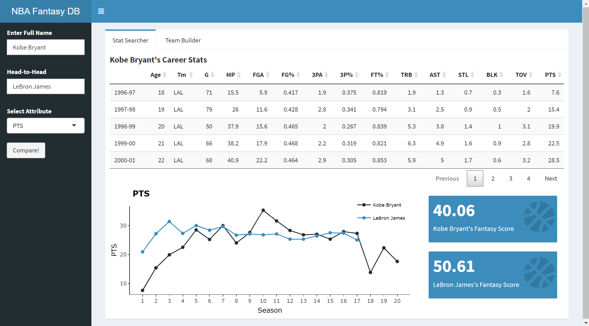
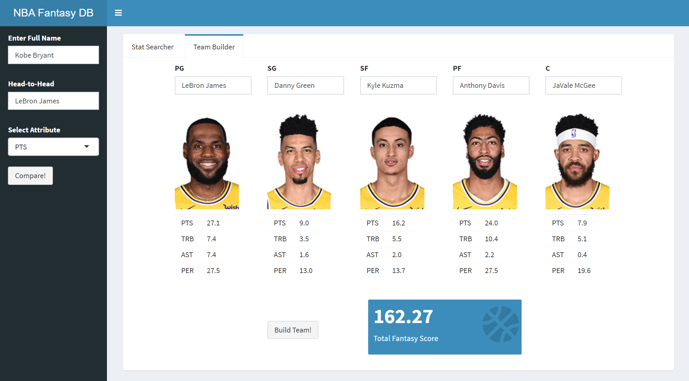

# NBA Fantasy Score Tracker
As a long-time NBA fanatic and stat geek, I've always just loved to look up NBA players' stats for no reason. Looking to brush up my Shiny skills, I built a simple Shiny app to track players' fantasy scores and form fantasy teams of my own. The app contains four main functions:

## Head-to-Head Comparisons
Compare players' different stats over the years at a glance, using the combination of ggplots and plotly.


## Search Engine for Player's Career Stats
Search for every players' career stats, displayed in a datatable format.

## Team-Building Mechanism
Build your fantasy starting lineup, and check out your teams' total fantasy score!


## Fantasy Score Calculator
Calculate the career fantasy score average for each player! The official formula is listed below:
```
PTS + 1.2 * TRB + 1.5 * AST + 3 * STL + 3 * BLK - TOV
```

The Shiny UI and server is placed in the [nba](./nba.R) file, while [nba_layout](./nba_layout.R) contains the code for the sidebar and body design, and [nba_func](./nba_func.R) has some functions I wrote for the app to be more effective.

This is just a simple prototype of my fantasy score tracker, and there are still some bugs yet to be fixed, but I'll definitely be adding more features to it as I continue to build up my skills in R.
Find my detailed description [here](https://andy27479.wixsite.com/mysite/post/playing-fantasy-basketball-using-r-and-shiny), and the app deployed on shinyapps.io [here](https://dershan219.shinyapps.io/nba_shiny/).
